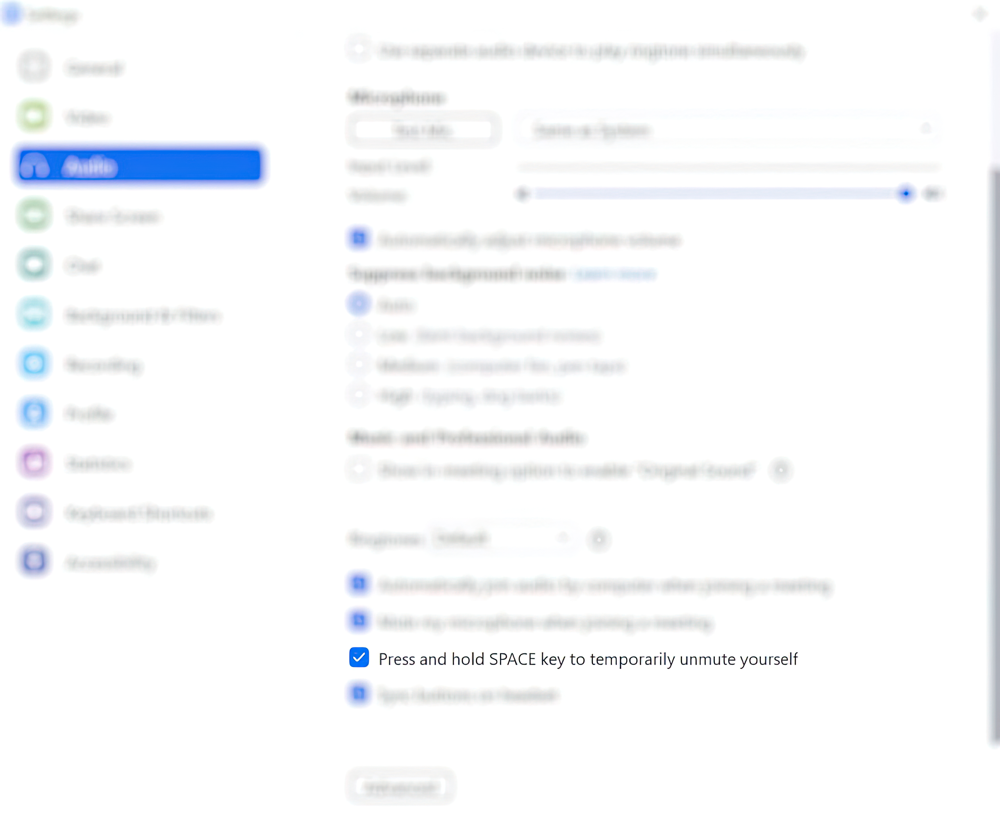
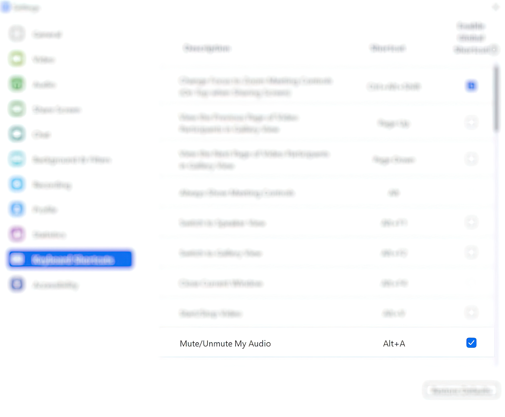

# SpeakCV

[](https://anthonytedja.github.io/speakCV/)

> SpeakCV is a desktop client that automates video call actions with OpenCV.

## Setup

Visit our [website](https://anthonytedja.github.io/speakCV/) and click the download button to get the zip file containing SpeakCV. (you will only need the speech_code folder), or get the speech_code folder directly from this repository.


### Zoom Settings

Under the Audio Section, make sure to enable microphone premute when joining a meeting so SpeakCV. will toggle correctly.



Under the Keyboard Shortcuts Section, make sure to enable the global shortcut for Mute/Unmute My Audio as Alt+A to ensure SpeakCV. will work in the background.



### Installing OBS

Ensure you have [OBS](https://obsproject.com/download) installed on your PC to use your webcam in Zoom with SpeakCV.

### Installing Anaconda

You will need  [Anaconda](https://www.anaconda.com/) in order to install the necessary dependencies for SpeakCV.

After installing Anaconda, open up Anaconda Powershell Prompt / Anaconda Prompt for the following commands.

You will need Python 3.9.12+ for SpeakCV. Check your current python version in the terminal with `python --version`

```bash
$ python --version
Python 3.9.12
```

Use the following command to install the correct version if your python version is not above 3.9.12:

```bash
conda install python=3.9.12
```

Create the environment from the `environment.yaml` file to install the dependencies:

```bash
conda env create -f environment.yaml
```

## Usage

Activate the environment:

```bash
conda activate deerhack
```

Run the GUI:

```bash
python gui.py
```

Now you're all set to use SpeakCV. alongside Zoom!

## Documentation

### :thought_balloon: Inspiration

Throughout our Zoom university journey, our team noticed that we often forget to unmute our mics when we talk, or forget to mute it when we don't want others to listen in. To combat this problem, we created SpeakCV, a desktop client that automatically mutes and unmutes your mic for you using computer vision to understand when you are talking.

### :wrench: How We Built It

We used Dlib's HOG-based face detector to map out landmark point on a user's face. We used a pre-existing model to extract 68 landmark coordinates which map to contours on a user's face. These landmark points can be used to map a user's facial features such as there eyebrows, eyes, nose, jaw, and mouth.


For SpeakCV, we are interested in the 20 landmark points used to map out a user's mouth. We used these points to calculate the aspect ratio of a user's mouth at any given time. We determined that if the aspect ratio of a user is above a certain threshold, we can reasonably assume that user is speaking. Once this is detected, SpeakCV. unmutes a user during their zoom call. When the user closes there mouth again, SpeakCV. will mute the user.

We used Tkinter to create a user-friendly interface that can be used to launch SpeakCV. The interface gives the user the option to see a debug window, which shows the detected facial feature in real time using OpenCV. The interface also allows the user to change the default mute delay from 5 seconds to whatever suits them.

### :star: The Features

- Automatic Zoom muting/unmuting based on user speech
- Customizable mute timeout duration
- Debug mode for developers

### :brain: What we learned

- How to setup and use virtual environments in Anaconda to ensure the program can run locally without issues.
- Working with virtual video/audio to access the streams from our own program.
- GUI creation for Python applications with Tkinter.

### :heart: What's next

- Improve the precision of the shape recognition model, by further adjusting the mouth aspect ratio or by tweaking the contour spots used in the algorithm for determining a user's mouth shape.
- Moving the application to the Zoom app marketplace by making the application with the Zoom SDK, which requires migrating the application to C++.
- Another option is to use the Zoom API and move the application onto the web.

### :link: The Links

- [Website](https://anthonytedja.github.io/speakCV/)
- [Devpost](https://devpost.com/software/speakcv)
- [Demo Video](https://www.youtube.com/watch?v=s5Hf1rLZhns)

### :hammer: The Team

- [@anthonytedja](https://github.com/anthonytedja)
- [@raghavst](https://github.com/raghavst)
- [@kevshinXP](https://github.com/kevshinXP)
- [@hani64](https://github.com/hani64)
